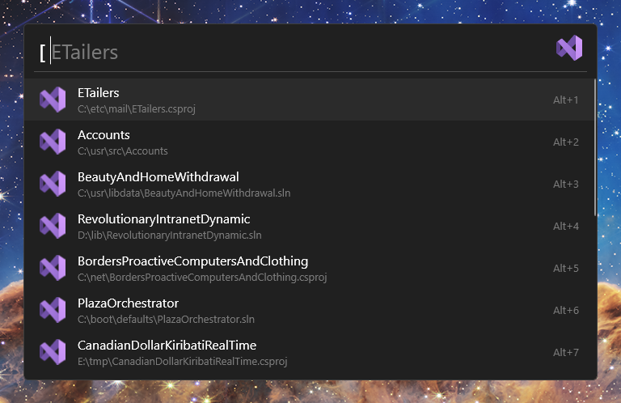
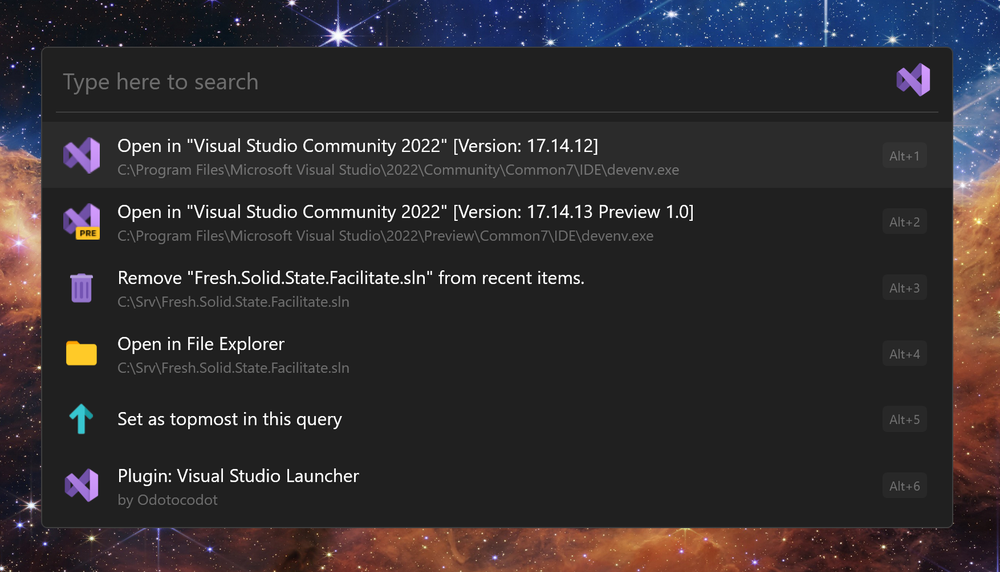
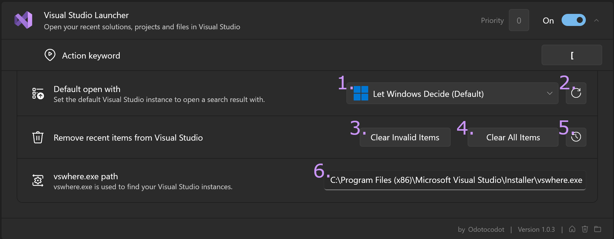

<p align="center">
    <a href="https://flowlauncher.com">
        
    </a>
    <a href="https://visualstudio.microsoft.com">
        
    </a>
</p>

<h1 align="center">Visual Studio for Flow Launcher</h1>

A [Flow launcher](https://github.com/Flow-Launcher/Flow.Launcher) plugin to let you quickly open your recent Visual Studio projects, solutions and files, as well as remove those pesky entries that exist no more!

## Installation
Type 
```
pm install Visual Studio Launcher
```
in Flow Launcher.
> [!IMPORTANT]
> Requires at least Flow Launcher version 1.16.

## Features
### Searching

Search all your recent items from **all** your Visual Studio installations.

| Command               | Description                                                |
| :-------------------- | :--------------------------------------------------------- |
| `[ {your search}`     | Search all recent items (if empty shows all).              |
| `[ p: {your search}`  | Search only recent projects (if empty shows all projects). |
| `[ f: {your search}`  | Search only recent files (if empty shows all files).       |



> [!NOTE]
> Theoretically works with any number of Visual Studio installations, provided they are Visual Studio 2017 version 15.2 or later, as it requires [vswhere](https://github.com/microsoft/vswhere).

### Context Menu

Press <kbd>⇧ Shift</kbd> + <kbd>⇥ Tab</kbd> or right-click on a search result (a recent item) to open the context menu shown below.

This allows for:
- Opening the item in a specific installation of Visual Studio.
- Removing the item from Visual Studio's recent items list.
- Opening the item in your default file manager.

 

> [!NOTE]
> The recent items list is ***shared*** between all your Visual Studio installations (although it can get out of sync), therefore, if you remove an item, it removes it from **all** Visual Studio installations recent item list.

### Settings



1. The default Visual Studio installation to open a search result with (when you press <kbd>⏎ Enter</kbd> or left-click). Clicking shows a dropdown of all the Visual Studio installations found on your system.  
2. Refresh the list of Visual Studio installations.
3. Clear invalid items from the recent items list i.e. if the path to said item does not exist remove it.
4. Removes all items from the recent items list.
5. Manage the backup (by default the backup is updated once a day, provided Flow Launcher has been launched that day).
   1. Restore recent items to the current backup
   2. Backup recent items right now
   3. Stop automatically updating the backup
6. The location of [vswhere.exe](https://github.com/microsoft/vswhere). The default value, set automatically by the plugin is vswhere's default install location. \
However, in case that this is incorrect you can change it! Though, you will need to reload plugin data (press <kbd>F5</kbd> when the Flow Launcher search window is open) or restart Flow Launcher for the change to take effect.

## Known Issues

- Sometimes the icons for each Visual Studio installation in the [context menu](#context-menu) are not shown, restarting Flow Launcher should fix the issue. 

## Acknowledgements 

- This [blog post](https://www.thomasbogholm.net/2021/06/18/pruning-recent-projects-in-start-page-of-visual-studio-2019-open-recent/) on where the recent items in Visual Studio are actually stored.
- The [Visual Studio Code plugin](https://github.com/taooceros/Flow.Plugin.VSCodeWorkspace) for Flow Launcher.
- Microsoft for the Visual Studio icons.
- [Icons8](https://icons8.com/) for the other icons.