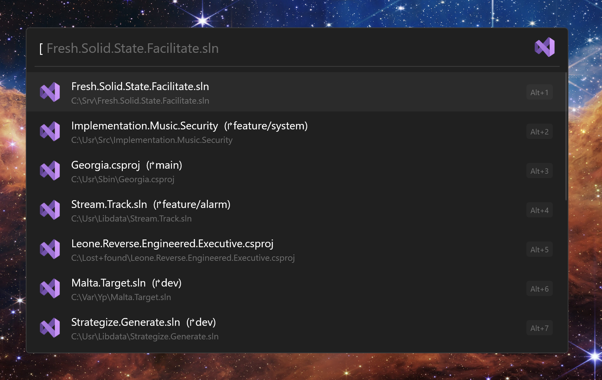

<p align="center">
    <a href="https://flowlauncher.com">
        
    </a>
    <a href="https://visualstudio.microsoft.com">
        
    </a>
</p>

<h1 align="center">Visual Studio for Flow Launcher</h1>

A [Flow launcher](https://github.com/Flow-Launcher/Flow.Launcher) to let you quickly open your recent projects, solutions and files in Visual Studio.

## Installation
Type 
```
pm install Visual Studio
```
> [!IMPORTANT]
> Requires at least Flow Launcher version 1.16

## Features
### Searching



| Command          | Description                                      |
| :--------------- | :----------------------------------------------- |
| `[ {search}`     | Search all recent items (if empty shows all).    |
| `[ p: {search}]` | Search all recent projects (if empty shows all). |
| `[ f: {search}]` | Search all recent files (if empty shows all).    |

Search all recent items from all your Visual Studio installations.

> [!NOTE]
> Theoretically works with any number of Visual Studio installations, provided they are Visual Studio 2017 version 15.2 or later, as it requires [vswhere](https://github.com/microsoft/vswhere).

### Context Menu

 

Press <kbd>⇧ Shift</kbd> + <kbd>⇥ Tab</kbd> or right-click on a search result to open the context menu (seen above).

This allows for:
- Opening the item in a specific installation of Visual Studio.
- Removing the item from Visual Studio's recent items list.

> [!NOTE]
> The recent items list is ***shared*** between all your Visual Studio installations (although it can get out of sync and then some weird things can happen), therefore if you remove an item, it removes it from all Visual Studio recent item lists.

### Settings


1. The default Visual Studio installation to open a search result with (when you press <kbd>⏎ Enter</kbd> or left-click).


   
2. Refresh the list of Visual Studio installations.
3. Clear invalid items from the recent items list i.e. if the path to said item does not exist remove it.
4. Removes all items from the recent items list.
5. Manage the backup (by default the backup is update one a day provided Flow Launcher has been launched).
   1. Restore the to the Last Backup
   2. Stop creating backups
   3. Backup now.


## Acknowledgements 

This [blog post](https://www.thomasbogholm.net/2021/06/18/pruning-recent-projects-in-start-page-of-visual-studio-2019-open-recent/) on where the recent items are actually stored.

The [Visual Studio Code plugin](https://github.com/taooceros/Flow.Plugin.VSCodeWorkspace) for Flow Launcher.

[Icons8](https://icons8.com/) for some icons.